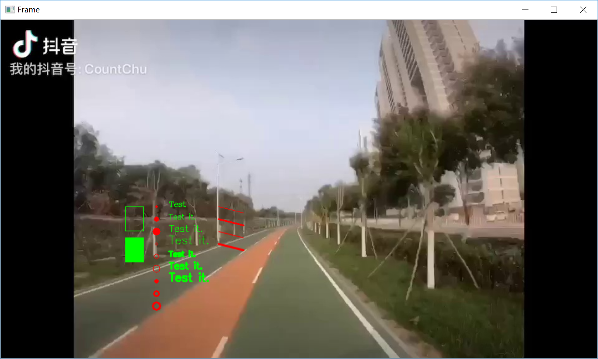

# PlayImages
The Python [PlayImages.py](PlayImages.py) plays images or video optionally step by step. The app is also a template. We can modify it to develop applications of computer vision.

## Usage
```
usage: PlayImages.py [-h] [-v] [--video VIDEOFN] [--images IMAGESDIR]
                     [--begin BEGINNUM] [--end ENDNUM] [--step]
                     [--goto GOTONUM] [-r] [--log LOGFN]
                     [--ri RECORDIMAGESDIR] [--fps] [--bn] [--sd SLOWDOWN]
                     [-t]

The app plays images or video optionally step by step.

Usage 1: python PlayImages.py --video TestVideo/video.MP4 --step
    Play the video file step by step.

Usage 2: python PlayImages.py --video TestVideo/video.MP4 --ri TestImages
    Play the video file and save frames in the TestImages directory.

Usage 3: python PlayImages.py --images TestImages --step
    Play images in the directory TestImages step by step.

Usage 4: python PlayImages.py --images TestImages --fps -r
    Play images in the directory TestImages with FPS and combined them in a
    video out.mp4.

Usage 5: python PlayImages.py --images TestImages --step -t
    Play images in the directory TestImages step by step and transform each
    frame by calling Util.transform(). You can modify the function to develop
    your specific application of computer vision.

Usage 6: python PlayImages.py --fps -r
    Open camera with FPS and save frames in out.mp4.

optional arguments:
  -h, --help            show this help message and exit
  -v                    Verbose log
  --video VIDEOFN       A path to the video file
  --images IMAGESDIR    A directory that contains images
  --begin BEGINNUM      Begin of the images
  --end ENDNUM          End of the images
  --step                Enable step. Press '>.' for next step and '<,' for previous step
  --goto GOTONUM        The argument follows --step.
  -r                    Record video.
  --log LOGFN           A name of a log file.
  --ri RECORDIMAGESDIR  A directory where images are recorded
  --fps                 Display fps.
  --bn                  Display base name.
  --sd SLOWDOWN         It follows -r. It slows down the output video by specifying a number of repeated frames
  -t                    Enable transformation.
```

## CV2 Examples in [Util.py](Util.py)
### def transform(frame)

The function provides examples of cv2 functions as below.
- cv2.rectangle()
- cv2.circle()
- cv2.putText()
- cv2.line()

You can try it by run the command.
```
python PlayImages.py --images TestImages --step -t
```

The you can see the green and red texts and pictures drawn by Util.transform() on the below frame.


